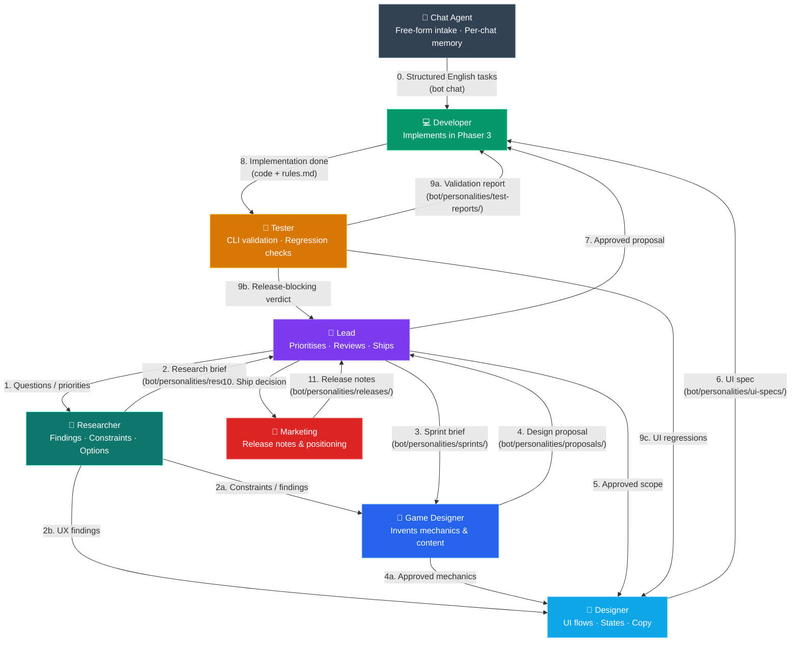
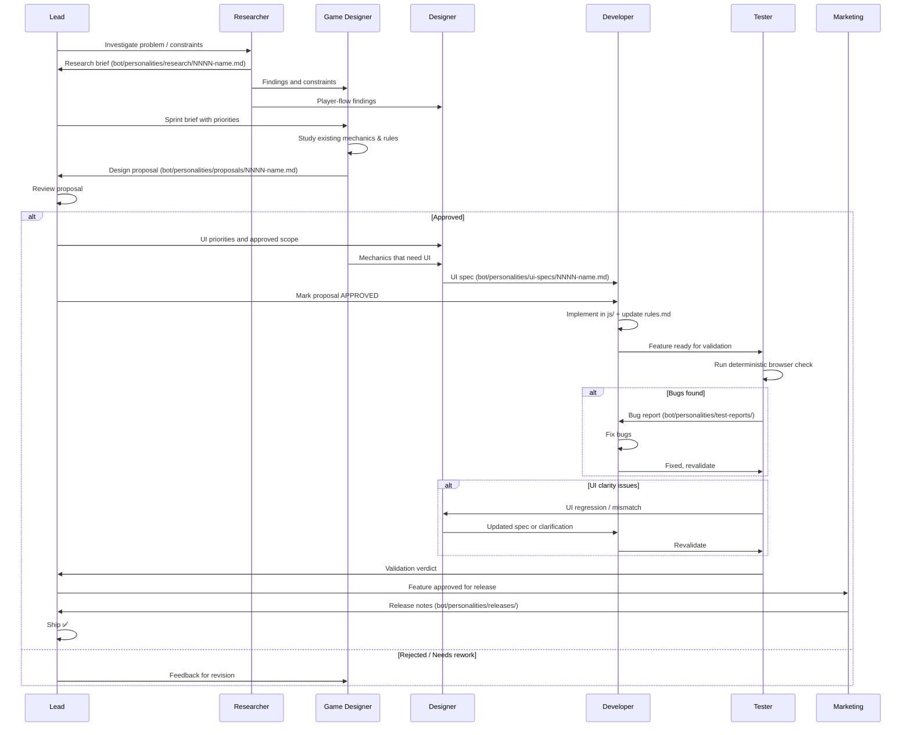

# Agent Workflow — Deck of Cats

This document defines how the current multi-agent setup collaborates on Deck of Cats development. Each personality guide lives in `bot/personalities/`.

## Agents

| Agent | File | Invoke | Role |
|-------|------|--------|------|
| **Chat Agent** | `bot/personalities/chat-agent.md` | plain chat | Per-chat concierge: accepts free-form messages, rewrites new tasks into English, and routes task/status/log requests |
| **Lead** | `bot/personalities/lead.md` | `/lead` | Prioritises work, reviews proposals and implementations, decides when a feature ships |
| **Researcher** | `bot/personalities/researcher.md` | `/researcher` | Maps constraints, studies the codebase, and writes decision-support briefs before design or implementation |
| **Game Designer** | `bot/personalities/game-designer.md` | `/game-designer` | Invents mechanics, pirates, islands, captains; writes design proposals |
| **Designer** | `bot/personalities/designer.md` | `/designer` | Translates approved goals into UI flows, screen states, copy, and interaction specs |
| **Developer** | `bot/personalities/developer.md` | `/developer` | Implements approved designs in Phaser 3 code |
| **Tester** | `bot/personalities/tester.md` | `/tester` | Runs deterministic browser validation with the project Playwright CLI workflow and reports exact failures |
| **Marketing** | `bot/personalities/marketing.md` | `/marketing` | Writes release notes, store descriptions, positioning |

## Interaction Diagram



## Artifact Directories

Each agent reads and writes to specific shared directories:

| Directory | Written by | Read by |
|-----------|-----------|---------|
| `bot/personalities/research/` | Researcher | Lead, Game Designer, Designer, Developer |
| `bot/personalities/sprints/` | Lead | Researcher, Game Designer, Designer, Developer |
| `bot/personalities/proposals/` | Game Designer | Lead, Designer, Developer, Tester |
| `bot/personalities/ui-specs/` | Designer | Lead, Developer, Tester |
| `bot/personalities/test-reports/` | Tester | Lead, Developer, Game Designer, Designer |
| `bot/personalities/releases/` | Marketing | Lead |
| `rules.md` | Developer (source of truth) | Everyone |

## Feature Lifecycle



## Conventions

### Proposal Files

`bot/personalities/proposals/NNNN-short-name.md` where NNNN is a zero-padded sequence number.

Structure:
```
# Proposal NNNN: Title
Status: DRAFT | REVIEW | APPROVED | SHIPPED
Author: Game Designer

## Summary
One paragraph.

## Detailed Design
Mechanics, numbers, interactions.

## New Pirates / Islands / Content
Tables with stats.

## Balance Rationale
Why these numbers work.

## Open Questions
```

### Sprint Files

`bot/personalities/sprints/NNNN.md` — written by Lead.

### Research Briefs

`bot/personalities/research/NNNN-short-name.md` — written by Researcher.

### Test Reports

`bot/personalities/test-reports/NNNN-short-name.md` — written by Tester after each validation run that needs a persistent report.

### UI Specs

`bot/personalities/ui-specs/NNNN-short-name.md` — written by Designer.

Structure:
```
# Test Report NNNN: Title
Scope: proposal / task / UI spec
Date: YYYY-MM-DD

## Verdict: PASS | FAIL | BLOCKED

## Commands
- ...

## Expected
- ...

## Actual
- ...
```

### Release Notes

`bot/personalities/releases/vX.Y.md` — written by Marketing.
