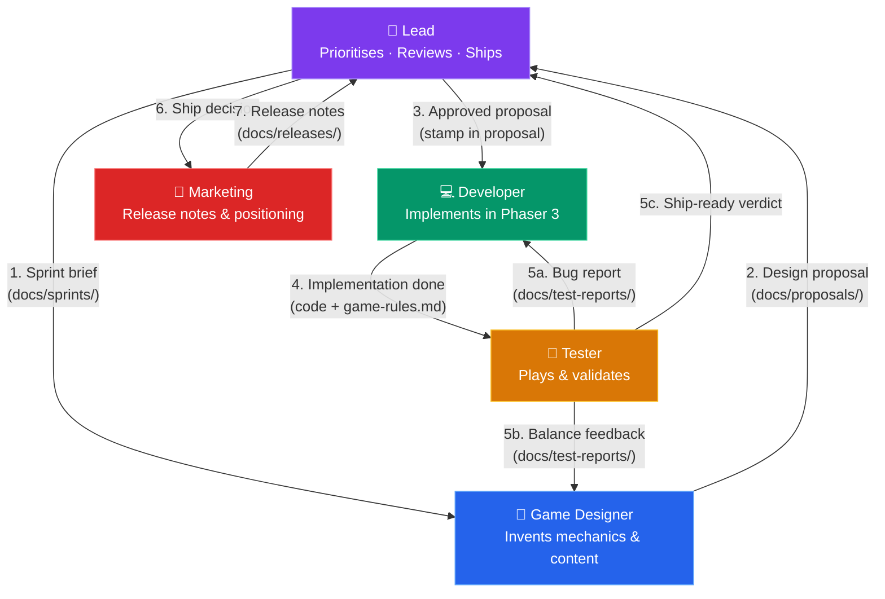
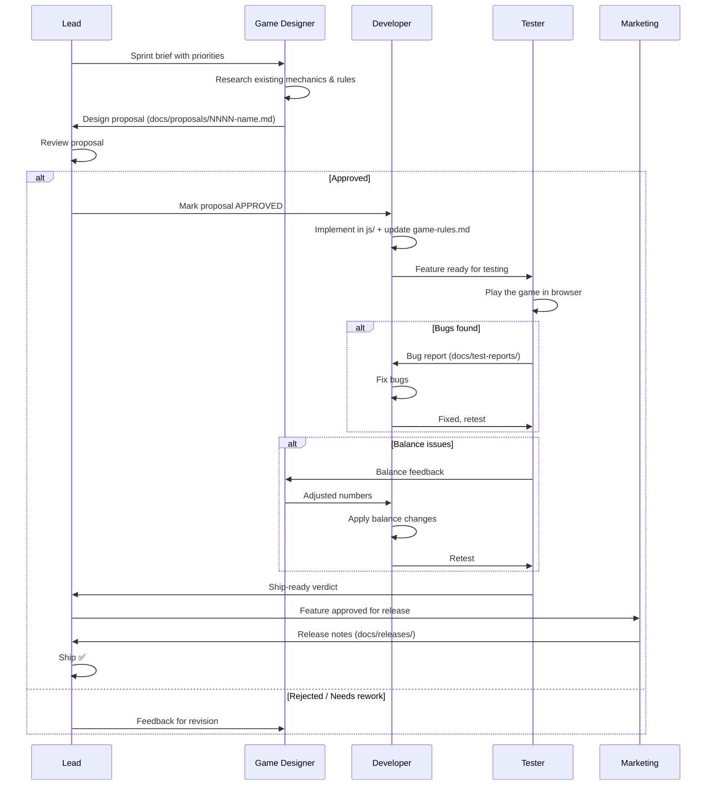

# Agent Workflow — Deck of Cats

This document defines how the five agents collaborate on game development. Each agent is a Cursor subagent defined in `.cursor/agents/`.

## Agents

| Agent | File | Invoke | Role |
|-------|------|--------|------|
| **Lead** | `.cursor/agents/lead.md` | `/lead` | Prioritises work, reviews proposals and implementations, decides when a feature ships |
| **Game Designer** | `.cursor/agents/game-designer.md` | `/game-designer` | Invents mechanics, pirates, islands, captains; writes design proposals |
| **Developer** | `.cursor/agents/developer.md` | `/developer` | Implements approved designs in Phaser 3 code |
| **Tester** | `.cursor/agents/tester.md` | `/tester` | Plays the game in-browser, verifies correctness and fun factor |
| **Marketing** | `.cursor/agents/marketing.md` | `/marketing` | Writes release notes, store descriptions, positioning |

## Interaction Diagram



## Artifact Directories

Each agent reads and writes to specific shared directories:

| Directory | Written by | Read by |
|-----------|-----------|---------|
| `docs/sprints/` | Lead | Game Designer, Developer |
| `docs/proposals/` | Game Designer | Lead, Developer |
| `docs/test-reports/` | Tester | Lead, Developer, Game Designer |
| `docs/releases/` | Marketing | Lead |
| `docs/game-rules.md` | Developer (source of truth) | Everyone |

## Feature Lifecycle



## Conventions

### Proposal Files

`docs/proposals/NNNN-short-name.md` where NNNN is a zero-padded sequence number.

Structure:
```
# Proposal NNNN: Title
Status: DRAFT | REVIEW | APPROVED | SHIPPED
Author: Game Designer

## Summary
One paragraph.

## Detailed Design
Mechanics, numbers, interactions.

## New Pirates / Islands / Content
Tables with stats.

## Balance Rationale
Why these numbers work.

## Open Questions
```

### Sprint Files

`docs/sprints/NNNN.md` — written by Lead.

### Test Reports

`docs/test-reports/NNNN-short-name.md` — written by Tester after each play session.

Structure:
```
# Test Report NNNN: Title
Proposal: NNNN
Date: YYYY-MM-DD

## Verdict: PASS | BUGS | BALANCE

## Bugs Found
- ...

## Balance Notes
- ...

## Fun Factor
Rating 1-5, commentary.
```

### Release Notes

`docs/releases/vX.Y.md` — written by Marketing.
