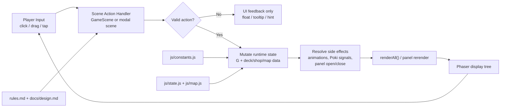

# Deck of Cats Architecture

This document describes the preferred architecture for the current version of Deck of Cats.

The project is a small Phaser 3 game prototype with no build step. The architecture is intentionally simple, but it must still stay disciplined enough for AI-assisted implementation and review.

## Core

### Architectural style

The current project should follow a **Flux/MVU-inspired state-first architecture for game prototypes**:

- gameplay rules are defined in documents first;
- content is defined in constants;
- runtime state lives in a single mutable state object;
- scene methods act as application actions that validate input and mutate state;
- rendering is a pure projection of the current state as much as Phaser allows;
- modal scenes may present state, but they should delegate important state changes back to the main game flow.

In practical terms, this means the game uses a unidirectional flow mindset:

- input triggers actions;
- actions validate and mutate state;
- UI is redrawn from the new state.

This is not a full enterprise architecture. It is a pragmatic adaptation of a well-known unidirectional UI architecture for a small game prototype.

### Source-of-truth hierarchy

1. `rules.md`
   This is the source of truth for gameplay rules, balance, phases, pirates, islands, and combat behavior.
2. `docs/design.md`
   This explains design intent, player experience, and progression goals.
3. `js/constants.js`
   This is the runtime content/config layer for pirate definitions, island definitions, and shop pools.
4. `js/state.js`
   This defines runtime state initialization and draw logic.
5. `js/scene.js` and modal scenes
   These implement the actual playable flow and rendering behavior.

### Main responsibilities

| Layer | Files | Responsibility |
|------|------|------|
| Design rules | `rules.md`, `docs/design.md` | Define what the game is supposed to do |
| Content/config | `js/constants.js` | Store islands, pirate definitions, prices, display strings, and shop pool |
| Runtime state | `js/state.js`, `js/map.js` | Create and evolve `G`, draw cards, generate the map |
| Layout system | `js/layout.js` | Convert viewport size into reusable UI coordinates and scales |
| App orchestration | `js/scene.js` | Own the main round flow, action handlers, phase transitions, and render coordination |
| Modal presentation | `js/mapScene.js`, `js/shopScene.js` | Present route/shop UI and delegate decisions back to the game flow |
| Extra scenes | `js/menuScene.js`, `js/costumesScene.js`, `js/allPiratesScene.js` | Menu and non-core informational/gallery screens |
| Presentation helpers | `js/cardHand.js` | Render the pirate hand and handle drag/hover interactions |
| Platform bridge | `js/pokiBridge.js`, `js/main.js`, `index.html` | Boot the game, integrate Poki SDK, create Phaser scenes |

### Runtime model

The center of the architecture is the global mutable object `G`.

`G` is allowed in this project because:

- the game is small;
- Phaser scenes are tightly coupled to the runtime;
- full UI redraws after meaningful state changes are acceptable at this scale.

However, `G` must be treated as the **single gameplay state container**, not as a dumping ground.

`G` should contain:

- deck/state data;
- resources;
- phase information;
- map progress;
- shop state;
- transient gameplay locks such as `busy` or `shopAnimating`.

`G` should not contain:

- cached view objects;
- Phaser display objects;
- layout measurements that belong to `computeLayout`;
- duplicated derived values that can be recomputed cheaply.

### Scene ownership model

`GameScene` is the gameplay orchestrator.

It owns:

- phase transitions;
- sending pirates to islands;
- island and ship effect resolution;
- buying pirates;
- boarding resolution;
- top-level rendering coordination through `renderAll()`.

Other scenes should stay narrower:

- `MapScene` visualizes the map and returns the selected node;
- `ShopScene` visualizes the shop and buy affordances;
- menu/gallery scenes do not own gameplay progression.

The rule is simple:

- if an action changes the actual run state, `GameScene` should own or approve it;
- modal scenes may request or trigger that action, but should not invent parallel gameplay state.

### Rendering rule

The preferred rendering loop is:

1. mutate state;
2. call `renderAll()` or the smallest safe equivalent;
3. let presentation containers rebuild from state.

This project already follows a full-redraw approach in many places. That is acceptable and preferred over hidden incremental state inside the view layer.

## Data Flow



### Practical flow constraints

- Input should enter through explicit handlers, not through arbitrary state mutation.
- Validation should happen before mutation when possible.
- Mutation should happen before rendering.
- Rendering should read from state, not infer hidden gameplay truth from display objects.
- Tooltip, hover, and animation state may live in scene fields, but gameplay truth must stay in `G`.

## Examples

### Example 1: gameplay state shape

```js
const G = {
  allCrew: [],
  deck: [],
  discard: [],
  hand: [],
  res: { wood: 0, stone: 0, gold: 0 },
  weapons: 0,
  cannons: 0,
  enthusiasm: 0,
  round: 0,
  phase: "map",
  sent: [],
  island: null,
  enemyShip: null,
  map: null,
  busy: false,
  shopAnimating: false,
};
```

### Example 2: action-handler pattern

```js
function sendToIsland(handIndex) {
  if (G.phase !== "sending") return;
  if (G.busy) return;
  if (G.sent.includes(handIndex)) return;

  const pirate = G.hand[handIndex];
  const def = TYPES[pirate.type];
  if (!def.canIsland) return;

  G.sent.push(handIndex);
  const result = resolveIsland(pirate);
  applyIslandResult(result);
  renderAll();
}
```

### Example 3: modal scene delegation

```js
function selectMapNode(nodeId) {
  const game = this.scene.get("game");
  game.applyMapNodeSelection(nodeId);
  this.scene.stop();
}
```

The important point is that the map modal does not become a second gameplay controller. It delegates the actual state mutation back to `GameScene`.

### Example 4: derived UI instead of duplicated truth

```js
function renderPhaseText() {
  if (G.phase === "boarding") return "Boarding! Prepare for battle!";
  if (G.phase === "ship") return "Ship at work…";
  if (G.phase === "shopping") return "You can hire new crew";
  return "Choose your action";
}
```

The displayed phase text is derived from `G.phase`. It is not stored separately in state.

## Review guidelines

Use these rules for code review. Treat them as strict checks, not vague suggestions.

### State ownership

- Reject code that stores gameplay truth inside Phaser display objects, containers, tweens, or tooltip state.
- Reject code that duplicates the same gameplay fact both in `G` and in some scene-local shadow object without a strong reason.
- Reject code that mutates deck, discard, hand, resources, or map progress from random helper modules with no clear owner.

### Flow integrity

- Reject code that bypasses action handlers and mutates `G` directly from unrelated UI callbacks when a game-flow method should own the transition.
- Reject code where modal scenes start owning core run progression instead of delegating to `GameScene`.
- Reject code that renders first and mutates gameplay state later in the same interaction unless the behavior is intentionally cosmetic.

### Separation of concerns

- Reject gameplay rules hidden inside presentation-only helpers such as card rendering or tooltip code.
- Reject view-only changes that require undocumented gameplay assumptions.
- Reject content additions that mix balancing logic into rendering code instead of putting it in `rules.md` and `js/constants.js`.

### Documentation discipline

- Reject any gameplay change that is not reflected in `rules.md` in the same change.
- Reject architecture changes that make this document false without updating this document.
- Reject new design assumptions that conflict with `docs/design.md` without explicit revision.

### Prototype-specific standards

- Prefer simple, explicit methods over abstract indirection that adds no clarity at this project size.
- Prefer full rerender from state over fragile partial UI mutation.
- Prefer readable, testable flow logic over hidden randomness.
- Prefer adding a small helper function over copy-pasting the same state transition logic across scenes.
