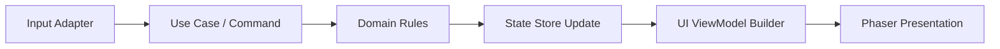
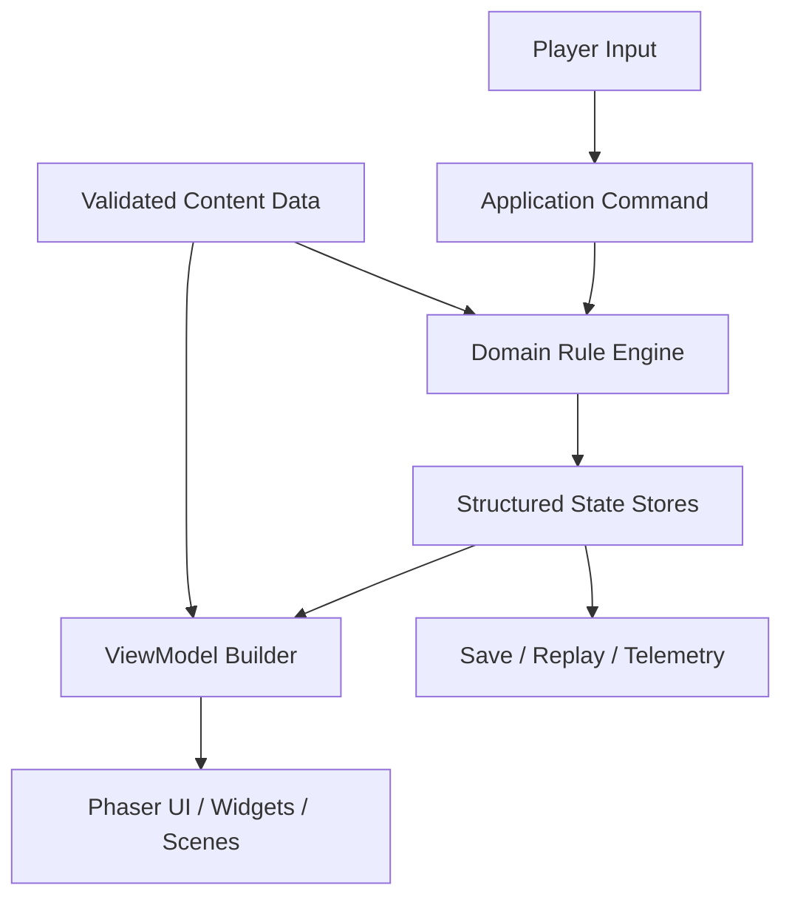

# Deck of Cats Big Project Architecture

This document extends [architecture.md](architecture.md) and describes how the project should evolve if Deck of Cats grows from a prototype into a large long-lived game.

The current architecture is good for a small Phaser prototype. It will not scale cleanly to a codebase with many developers, large content volume, live operations, or multiple platforms.

## What Changes At Large Scale

The prototype architecture would start failing in these areas:

- one global mutable state object becomes too broad;
- one large gameplay scene becomes a bottleneck for ownership and review;
- content in one constants file becomes hard to balance and validate;
- direct coupling between state mutation and rendering becomes too risky;
- documentation-only balancing becomes too easy to drift from runtime data.

At large scale, the architecture should shift from **state-first prototype orchestration** to **feature-oriented layered architecture**.

## Target large-project structure

### 1. Split the codebase into stable layers

The large-project version should use these layers:

| Layer | Purpose |
|------|------|
| Domain | Pure gameplay rules, formulas, turn resolution, economy, content schemas |
| Application | Use cases, orchestration, save/load flow, progression systems, analytics dispatch |
| Presentation | Phaser scenes, widgets, UI composition, animation, input adapters |
| Infrastructure | Storage, telemetry, platform SDKs, remote config, asset loading, localization |
| Content | Data files for pirates, islands, encounters, balance tables |

Domain logic should become largely engine-agnostic.

### 2. Replace one global `G` with bounded state stores

Instead of one giant object, split runtime state into explicit modules such as:

- `RunState`
- `CombatState`
- `MapState`
- `ShopState`
- `MetaProgressionState`
- `SessionUiState`

Each store should have:

- a typed schema;
- clear ownership;
- a reducer or transition API;
- serialization rules.

### 3. Move content into external data

Pirates, islands, encounters, shop pools, and reward tables should move out of one JS constants file into validated data assets such as JSON, YAML, or generated content files.

That content pipeline should include:

- schema validation;
- required-field validation;
- balancing checks;
- duplicate-ID checks;
- localization support;
- tooling for designers to edit content without editing code.

### 4. Convert scene methods into use-case calls

Large-project gameplay flow should look like this:

This allows:

- unit testing domain logic without Phaser;
- deterministic replay of runs;
- lower risk when UI changes;
- clearer ownership across multiple developers.

## Recommended module breakdown

### Domain modules

- `domain/run/`
- `domain/combat/`
- `domain/map/`
- `domain/shop/`
- `domain/content/`

Each domain module should expose pure operations such as:

- `resolveIslandAction`
- `resolveShipActions`
- `resolveBoarding`
- `advanceShop`
- `generateMapSegment`

### Application modules

- `application/start_run`
- `application/select_map_node`
- `application/send_pirate`
- `application/end_landing`
- `application/buy_pirate`
- `application/advance_round`
- `application/resolve_boarding`

These use cases should coordinate domain operations, side effects, persistence, and analytics.

### Presentation modules

- `presentation/scenes/`
- `presentation/widgets/`
- `presentation/viewmodels/`
- `presentation/layout/`
- `presentation/animation/`

Presentation should consume view models instead of reading raw domain internals everywhere.

## Data flow at scale

The important difference from the prototype is that large-project rendering should not directly own gameplay resolution.

## Additional systems required at scale

### Save/versioning

You will need:

- versioned save schemas;
- migration logic between versions;
- replay-safe deterministic identifiers;
- separation between run-state saves and meta-progression saves.

### Testing

You will need:

- unit tests for domain formulas and transitions;
- content validation tests;
- golden-path opening-flow tests;
- deterministic simulation tests for balance;
- integration tests for use cases;
- browser smoke tests for critical UI flows.

### Team ownership

You will need code ownership boundaries such as:

- combat team owns `domain/combat`;
- progression/content team owns content tables and schemas;
- client/UI team owns scenes and widgets;
- tools team owns data validation and authoring tools.

Without this, review quality collapses as the project grows.

### Observability

The large project should track:

- loading and onboarding metrics;
- turn completion and abandonment points;
- first-session step completion;
- economy sinks and sources;
- crash and invalid-state diagnostics.

### Tooling for designers

For a large project, designers should not edit code to make routine content changes.

The project should support:

- data tables for pirates and islands;
- scriptable opening beats;
- automated diff-friendly balancing outputs;
- generated reference docs from content data.

## Migration path from the current prototype

Do not rewrite everything at once.

A sensible path is:

1. extract pure gameplay helpers from `js/scene.js`;
2. introduce explicit action functions for each state transition;
3. separate content data from rendering data;
4. isolate save-ready state shapes;
5. split `GameScene` into orchestration and presentation helpers;
6. move validated content into external files;
7. only then introduce stronger layering and tooling.

## Large-project review focus

When the project becomes large, reviewers should care much more about:

- domain logic leaking into presentation;
- content data without schema validation;
- feature modules reading each other's private internals;
- missing ownership boundaries;
- untestable state transitions;
- hidden side effects inside view code;
- save compatibility and migration risks.

The prototype can tolerate some shortcuts. A large project cannot.
