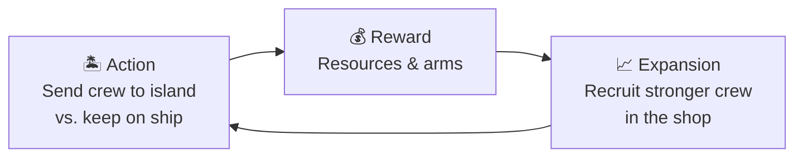
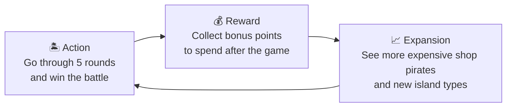
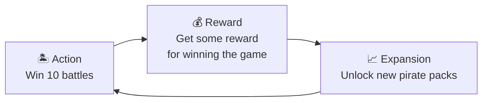
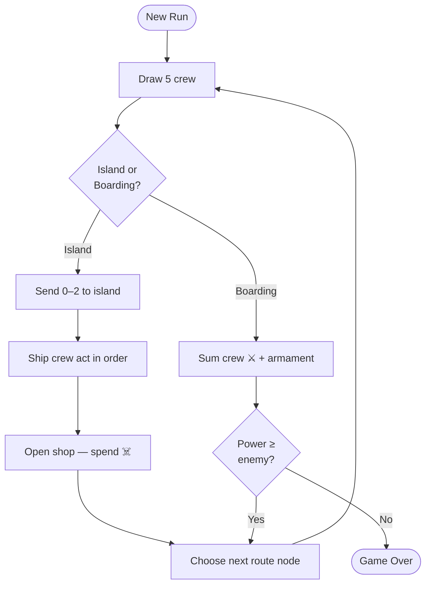

# Deck of Cats — Game Design

A mobile rogue-like deck-builder where you manage a crew of cats sailing from island to island, gathering resources, arming your ship, and surviving increasingly dangerous boarding battles.

## Core Loop

**Action.** Five crew members are drawn from the player's deck. The player chooses which ones (0–2) to send ashore and which stay on the ship:

- Island crew gather raw resources (wood, stone, occasionally gold) with a success chance. Misses still yield a consolation pickup, so nothing feels completely wasted.
- Ship crew convert stockpiled resources into enthusiasm (the game's currency) and armament (weapons or cannons for future battles).

**Reward.** Rewards are immediate and visible: resource counters tick up, weapon/cannon icons appear. The player feels the compounding effect of earlier decisions — resources gathered three rounds ago become the weapons that will win the next fight.

**Expansion.** The shop offers a rolling window of recruitable crew members, purchased with enthusiasm the player collected this turn. New crew members go into the deck and start appearing in future hands.
Different crew members unlock new resource chains and mechanics.

## Bigger Loops

## Difficulty Curve and Progression

### The Boarding Clock

Every 5th round, instead of an island, an enemy ship appears. All five crew members in hand fight: their combined strength plus armament bonuses must meet or exceed the enemy's power.

This linear escalation is the game's clock. It creates steady pressure without sudden spikes, and it's always visible — the player can count rounds and plan ahead.

To win the battles, the player has to balance between gaining bigger short-term (swords) and smaller long-term (cannons) power.

### Progression Tiers

The shop pool and pricing create three natural eras of a run:

| Era | Rounds | Budget | What the player is doing |
|-----|--------|--------|--------------------------|
| **Early** | 1–8 | 2–5 ☠️/round | Learning the split. Buying cheap specialists (Carpenter, Stonemason, Brute) to replace starter crew. Surviving the first boarding with raw strength. |
| **Mid** | 9–18 | 5–10 ☠️/round | Building resource chains. Buying Woodsmen, Prospectors, Smugglers. Accumulating cannons for long-term power. Thinning the deck with Cutthroat. |
| **Late** | 19+ | 10+ ☠️/round | Chasing Master-tier crew and Treasure Hunters. Every hand should produce significant value. Cannon stockpile carries the boarding checks. |

## Session Structure

(AI agents generated it for us for no reason but it looks cool so we’ll leave it here)

