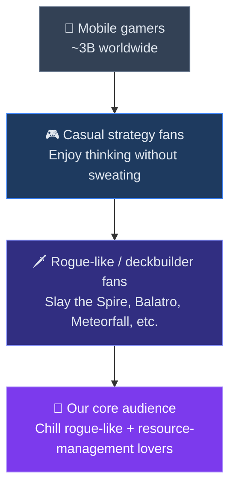

# Deck of Cats — Marketing

Deck of Cats is a chill deck-builder for mobile where you recruit a crew of cats, sail between islands, gather resources, and survive escalating pirate battles.

## Audience Funnel

