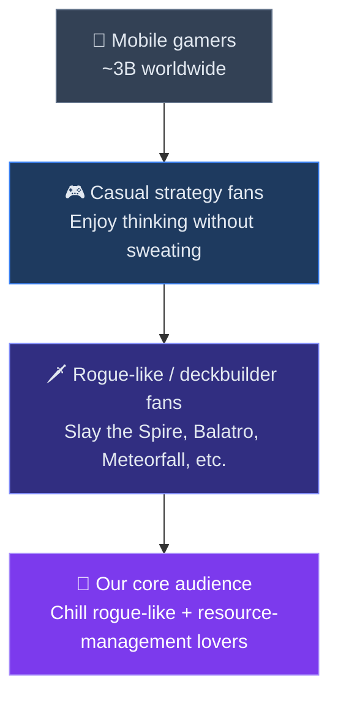

# Deck of Cats — Marketing

Deck of Cats is a chill deck-builder for mobile where you recruit a crew of cats, sail between islands, gather resources, and survive escalating pirate battles.

## Audience Funnel

## Positioning

- Core hook: `deckbuilder about pirate cats`.
- Fast explanation: `build a cat pirate crew, send cats to islands, stack resources, survive boarding fights`.
- Strongest advantages for marketing:
  - easy-to-read runs for creators and viewers
  - cute / funny theme with a clear visual identity
  - enough strategy to appeal to deckbuilder audiences
  - a strong theme that is easy to explain fast

## Marketing Beats Plan

| Beat | Timing | Asset | Goal |
|---|---|---|---|
| First reveal | When we have a high-quality demo | 1 GIF + 1 screenshot + one-line pitch | Make the first impression strong enough to justify attention and outreach. |
| Playable demo beat | Right after the reveal of the high-quality demo | Direct build link | Give players and creators their first hands-on impression. |
| Pirate spotlight beat | Before outreach wave | 3-5 short posts about specific pirates / combos | Show personality and make the game memorable beyond “another deckbuilder.” |
| Strategy hook beat | Same week as pirate spotlight | Short post or tiny devlog on `send to island vs keep on ship` | Explain the unique decision loop in one simple mechanic. |
| Creator outreach beat | When the demo feels polished for first impressions | Personalized email / DM + GIF + link | Turn the pitch into coverage. |
| Release beat | Launch week | Trailer or GIF thread + build link + challenge post | Convert attention into plays and shares. |
| Post-launch update beat | 1-2 weeks after launch | New pirate / balance patch / quality-of-life post | Create a second reason to cover the game. |

## Best Angle For Creators

- `It has readable choices, so it works on stream and in edited YouTube videos.`
- `The pirate-cat hook is funny enough to click, but the deckbuilding is still real.`
- `A creator can understand the premise in 10 seconds and start a run immediately.`

## Suggested Timeline

1. Post a first GIF and one-line hook.
2. A few days later, post a pirate spotlight or combo spotlight.
3. Open the first public build.
4. Start the first creator outreach wave.
5. Repost the strongest reactions, clips, or screenshots.
6. Launch a challenge beat: highest streak, best crew, or best boarding win.
7. Ship a content / balance update and run a second outreach wave.

## Concrete Content Ideas

- `Meet the crew` posts: one pirate card per post.
- `Run diary` posts: one screenshot + one sentence explaining a funny or strong combo.
- `How this works` post: island action vs ship action.
- `Why this theme works` post: why pirate cats make the deckbuilder more memorable.
- `Devlog` post: how the pirate cats theme changed the deckbuilder format.
- `Challenge` post: “can you survive X boarding fights?”

## Assets Checklist

- 1 hero screenshot with the hand, island, and top HUD visible.
- 1 short GIF that shows cards moving and a reward / combat result.
- 1 sentence pitch.
- 1 slightly longer 2-3 sentence pitch for creators and press.
- 1 page with links: playable build, trailer / GIF, and contact info.
